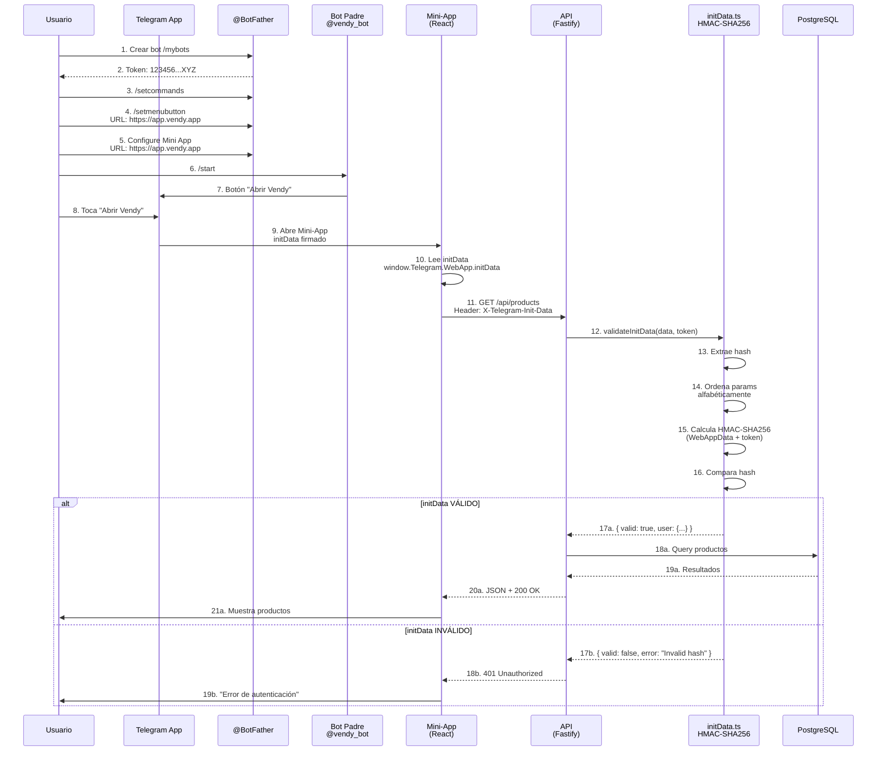
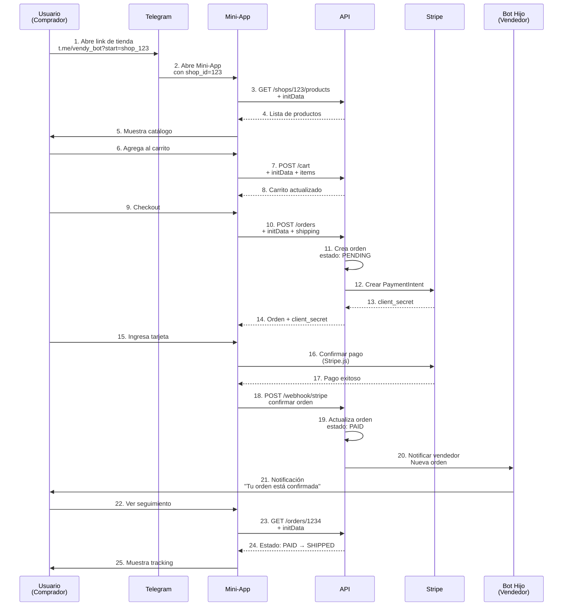
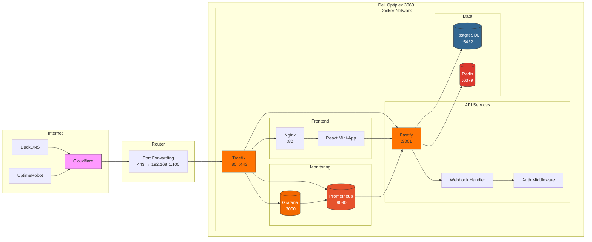
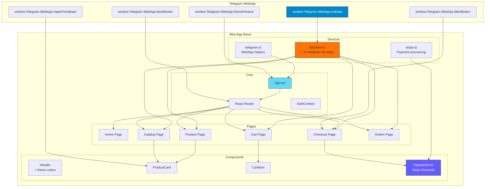
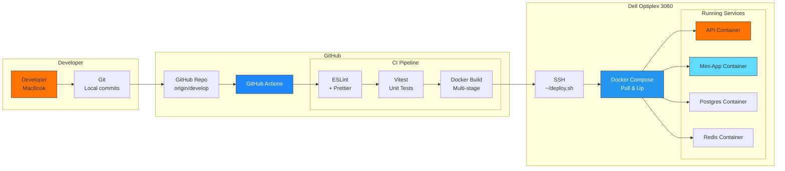

# Arquitectura Vendy - Diagrama Mermaid

## Diagrama de Flujo Completo (Mermaid)

```mermaid
graph TB
    subgraph Internet["🌐 Internet"]
        Cloudflare["Cloudflare<br/>DNS + SSL + CDN + DDoS"]
    end

    subgraph Router["🏠 Router (Casa/Oficina)"]
        PortForwarding["Port Forwarding<br/>443 → Dell"]
    end

    subgraph Dell["🖥️ Dell Optiplex 3060<br/>Ubuntu Server 22.04"]
        subgraph Docker["🐳 Docker Compose"]
            Traefik["Traefik<br/>Reverse Proxy + SSL<br/>Let's Encrypt"]
            
            subgraph API["⚡ API (Fastify + Node.js)"]
                Fastify["Fastify Server<br/>Port 3001"]
                WebhookRoute["/webhook<br/>Telegram Updates"]
                APIRoutes["/api/*<br/>Endpoints"]
                MetricsRoute["/metrics<br/>Prometheus"]
                HealthRoute["/health<br/>Health Check"]
                
                subgraph Middleware["Middleware"]
                    Auth["authenticateTelegram<br/>Valida initData"]
                    RateLimit["Rate Limiting<br/>Redis Sliding Window"]
                    CORS["CORS<br/>Telegram Domains"]
                end
                
                subgraph Services["Services"]
                    BotService["Bot Service<br/>Telegraf (grammy)"]
                    PaymentService["Payment Service<br/>Stripe + Webhooks"]
                    NotificationService["Notification Service<br/>Telegram Bot API"]
                end
                
                subgraph Libs["Libraries"]
                    InitData["initData.ts<br/>HMAC-SHA256 Validation"]
                    Metrics["metrics.ts<br/>Prometheus Client"]
                end
            end
            
            subgraph MiniApp["📱 Mini-App (React + Vite)"]
                Nginx["Nginx<br/>Port 80"]
                React["React App<br/>@twa-dev/sdk"]
                ApiClient["ApiClient.ts<br/>X-Telegram-Init-Data"]
                TelegramHelpers["telegram.ts<br/>WebApp Helpers"]
            end
            
            subgraph Database["🗄️ Base de Datos"]
                Postgres[(PostgreSQL<br/>Port 5432)]
                Redis[(Redis<br/>Port 6379)]
            end
            
            subgraph Monitoring["📊 Monitoreo"]
                Prometheus[(Prometheus<br/>Port 9090)]
                Grafana[(Grafana<br/>Port 3000)]
                NodeExporter["Node Exporter"]
                PostgresExporter["PostgreSQL Exporter"]
                RedisExporter["Redis Exporter"]
            end
            
            subgraph Bots["🤖 Bots Telegram"]
                BotParent["Bot Padre<br/>@vendy_bot<br/>Onboarding + Admin"]
                BotChild["Bot Hijo<br/>@vendy_shop_bot<br/>Catálogo + Checkout"]
            end
        end
    end

    subgraph Telegram["💬 Telegram"]
        BotFather["@BotFather<br/>Configuración"]
        User["Usuario<br/>Telegram App"]
        MiniAppView["Mini-App View<br/>Dentro de Telegram"]
    end

    subgraph External["🔗 Servicios Externos"]
        Stripe["Stripe<br/>Pagos"]
        DuckDNS["DuckDNS<br/>IP Dinámica"]
        UptimeRobot["UptimeRobot<br/>Monitoreo Externo"]
    end

    %% Flujos de Internet
    Cloudflare --> PortForwarding
    PortForwarding --> Traefik
    
    %% Traefik Routing
    Traefik --> Fastify
    Traefik --> Nginx
    Traefik --> Prometheus
    Traefik --> Grafana
    
    %% API Internals
    Fastify --> WebhookRoute
    Fastify --> APIRoutes
    Fastify --> MetricsRoute
    Fastify --> HealthRoute
    
    APIRoutes --> Auth
    Auth --> InitData
    Auth --> RateLimit
    Auth --> CORS
    
    WebhookRoute --> BotService
    BotService --> BotParent
    BotService --> BotChild
    
    APIRoutes --> PaymentService
    PaymentService --> Stripe
    
    APIRoutes --> NotificationService
    NotificationService --> BotParent
    
    %% Mini-App
    Nginx --> React
    React --> ApiClient
    React --> TelegramHelpers
    ApiClient --> Auth
    
    %% Database
    Fastify --> Postgres
    Fastify --> Redis
    BotService --> Postgres
    BotService --> Redis
    
    %% Monitoring
    Prometheus --> NodeExporter
    Prometheus --> PostgresExporter
    Prometheus --> RedisExporter
    Prometheus --> MetricsRoute
    Grafana --> Prometheus
    
    %% Telegram Flow
    User --> BotFather
    BotFather --> BotParent
    User --> BotParent
    BotParent --> MiniAppView
    MiniAppView --> ApiClient
    
    %% External
    Dell --> DuckDNS
    DuckDNS --> Cloudflare
    UptimeRobot --> Cloudflare
    
    %% Webhooks
    Stripe --> WebhookRoute
    Telegram --> WebhookRoute

    %% Estilos
    style Cloudflare fill:#f9f,stroke:#333,stroke-width:2px
    style Traefik fill:#ff7403,stroke:#333,stroke-width:2px
    style Fastify fill:#ff7403,stroke:#333,stroke-width:2px
    style React fill:#61dafb,stroke:#333,stroke-width:2px
    style Postgres fill:#336791,stroke:#333,stroke-width:2px,color:#fff
    style Redis fill:#dc382d,stroke:#333,stroke-width:2px,color:#fff
    style Prometheus fill:#e6522c,stroke:#333,stroke-width:2px,color:#fff
    style Grafana fill:#f46800,stroke:#333,stroke-width:2px,color:#fff
    style BotParent fill:#0088cc,stroke:#333,stroke-width:2px,color:#fff
    style BotChild fill:#0088cc,stroke:#333,stroke-width:2px,color:#fff
    style User fill:#0088cc,stroke:#333,stroke-width:2px,color:#fff
    style Stripe fill:#635bff,stroke:#333,stroke-width:2px,color:#fff
```



---

## Diagrama de Secuencia - Flujo de Autenticación



---

## Diagrama de Secuencia - Flujo de Compra



---

## Diagrama de Infraestructura - Self-Hosted



---

## Diagrama de Componentes - Mini-App



---

## Diagrama de Despliegue - CI/CD



---

## Cómo usar estos diagramas

### En GitHub/GitLab
Estos diagramas usan **Mermaid**, que se renderiza nativamente en:
- GitHub Markdown (README.md, PRs, Issues)
- GitLab Markdown
- Notion (bloque Mermaid)
- VS Code (extensión Markdown Preview Mermaid Support)

### En documentación
Copiá el bloque ` ```mermaid ` completo y pegalo en cualquier archivo `.md`.

### Para exportar como imagen
1. Usá [Mermaid Live Editor](https://mermaid.live)
2. Pegá el código
3. Descargá como SVG, PNG o PDF

---

## Archivo fuente

Este archivo está en:
`/Users/marcelo/Desktop/Proyectos/Vendy/docs/architecture-diagrams-mermaid.md`
