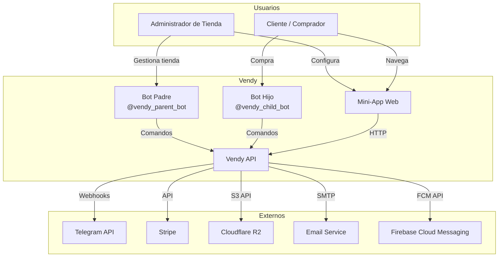
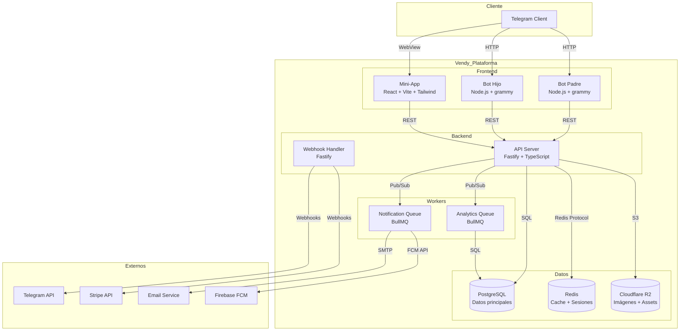
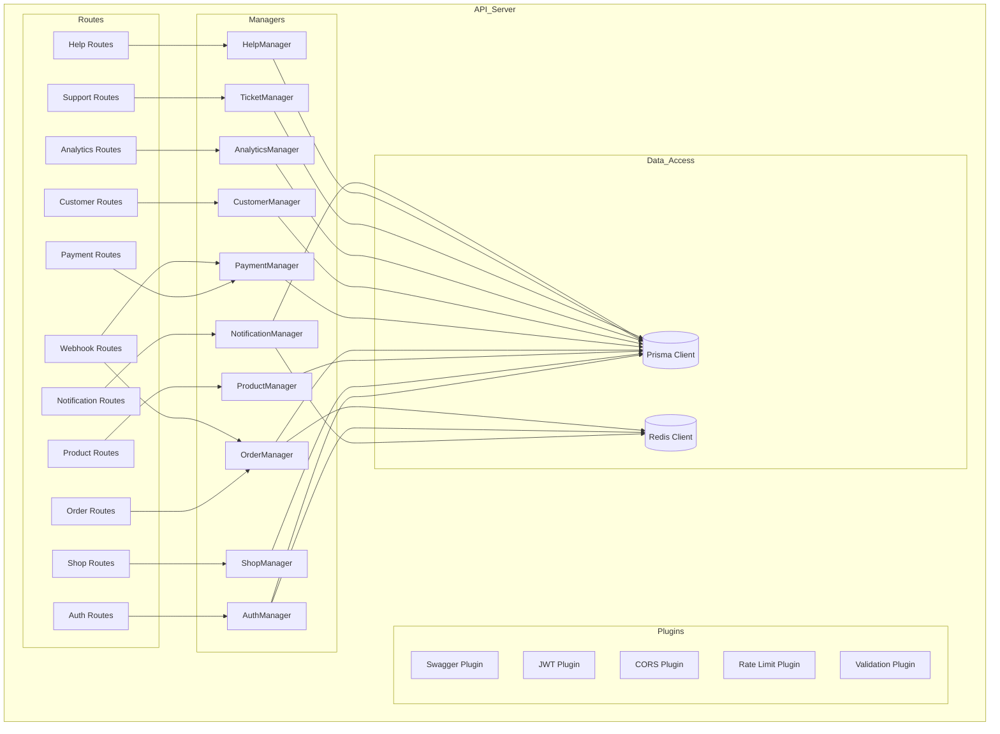
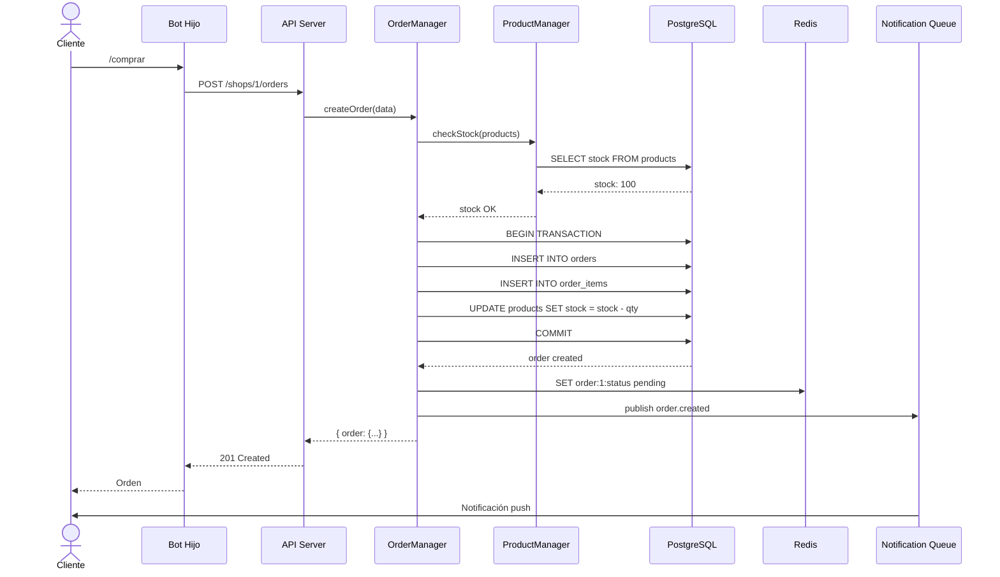
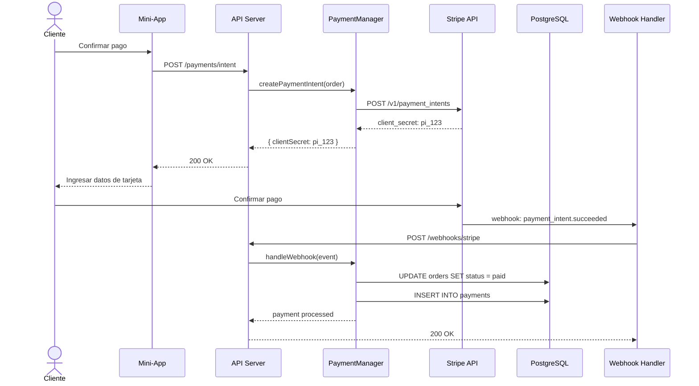
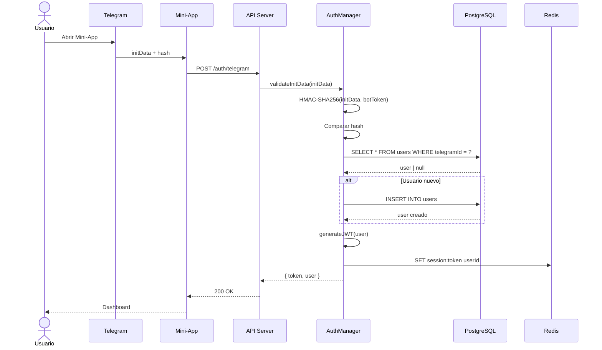
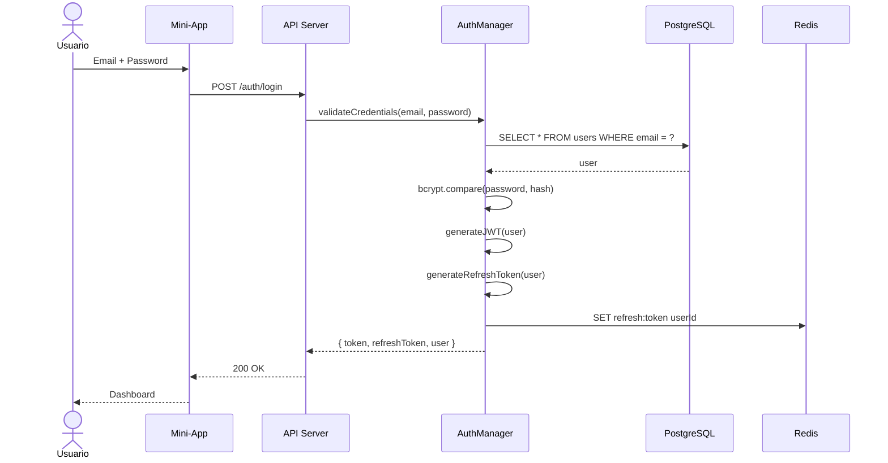
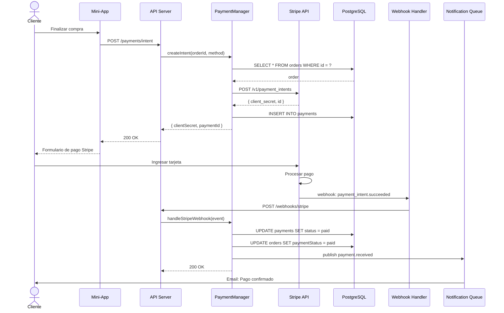
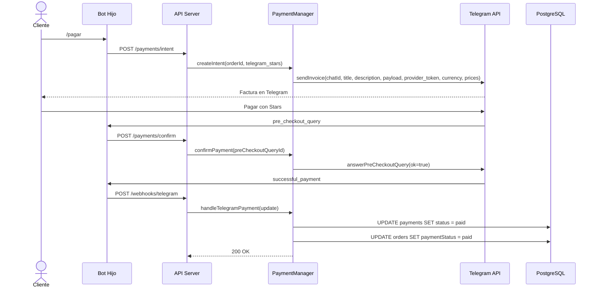

# Arquitectura de Vendy

> **Store-as-a-Service para Telegram** — Documentación de arquitectura

---

## Tabla de Contenidos

1. [Visión General](#visión-general)
2. [Diagrama de Contexto (C4 Nivel 1)](#diagrama-de-contexto)
3. [Diagrama de Contenedores (C4 Nivel 2)](#diagrama-de-contenedores)
4. [Diagrama de Componentes (C4 Nivel 3)](#diagrama-de-componentes)
5. [Flujo de Datos](#flujo-de-datos)
6. [Flujo de Autenticación](#flujo-de-autenticación)
7. [Flujo de Pagos](#flujo-de-pagos)
8. [Decisiones de Arquitectura (ADRs)](#decisiones-de-arquitectura)
9. [Diagrama de Base de Datos](#diagrama-de-base-de-datos)
10. [Stack Tecnológico](#stack-tecnológico)
11. [Patrones y Anti-patrones](#patrones-y-anti-patrones)

---

## Visión General

Vendy es una plataforma de comercio electrónico multi-tenant diseñada para operar dentro del ecosistema de Telegram. La arquitectura sigue un modelo de tres capas:

- **Capa de Presentación:** Bots de Telegram + Mini-App React
- **Capa de Aplicación:** API REST con Fastify
- **Capa de Datos:** PostgreSQL + Redis + Cloud Storage

### Principios Arquitectónicos

1. **Multi-tenancy por row-level:** Cada tabla tiene `shop_id` para aislamiento de datos
2. **API-first:** Toda la lógica de negocio expuesta vía API REST
3. **Event-driven:** Webhooks para integraciones externas
4. **Stateless:** Servidores sin estado, sesiones en Redis
5. **Horizontal scalability:** Diseñado para escalar con load balancers

---

## Diagrama de Contexto



**Actores:**

| Actor | Rol | Interacción |
|-------|-----|-------------|
| Administrador | Crea y gestiona tiendas | Bot Padre, Mini-App |
| Cliente | Compra productos | Bot Hijo, Mini-App |
| Telegram | Plataforma de mensajería | Webhooks, Bot API |
| Stripe | Procesamiento de pagos | API REST, Webhooks |
| Cloudflare R2 | Almacenamiento de imágenes | S3-compatible API |
| Email Service | Envío de notificaciones | SMTP/API |
| FCM | Push notifications | Firebase API |

---

## Diagrama de Contenedores



**Contenedores:**

| Contenedor | Tecnología | Responsabilidad |
|------------|------------|-----------------|
| Bot Padre | grammy (Node.js) | Gestión de tiendas, administración |
| Bot Hijo | grammy (Node.js) | Experiencia de compra para clientes |
| Mini-App | React + Vite + Tailwind | Interfaz web rica dentro de Telegram |
| API Server | Fastify + TypeScript | Lógica de negocio, autenticación, CRUD |
| Webhook Handler | Fastify | Recepción de webhooks de Telegram y Stripe |
| PostgreSQL | PostgreSQL 15+ | Datos persistentes, relaciones, transacciones |
| Redis | Redis 7+ | Cache, sesiones, rate limiting, colas |
| Cloudflare R2 | S3-compatible | Almacenamiento de imágenes y archivos |
| Notification Queue | BullMQ + Redis | Procesamiento asíncrono de notificaciones |
| Analytics Queue | BullMQ + Redis | Procesamiento asíncrono de métricas |

---

## Diagrama de Componentes

### API Server (Nivel 3)



---

## Flujo de Datos

### 1. Creación de Orden (Happy Path)



### 2. Procesamiento de Pago



---

## Flujo de Autenticación

### 1. Login con Telegram (Mini-App)



### 2. Login con Email/Password



---

## Flujo de Pagos

### 1. Stripe Checkout



### 2. Telegram Stars



---

## Decisiones de Arquitectura (ADRs)

### ADR-001: Fastify vs Express

**Contexto:** Necesitábamos un framework HTTP para el backend API.

**Opciones consideradas:**
- Express.js (más popular, más middlewares)
- Fastify (mejor performance, schema validation nativa)
- NestJS (más opinionado, más completo)

**Decisión:** Fastify

**Rationale:**
- ✅ Mejor performance (2x más rápido que Express en benchmarks)
- ✅ Schema validation nativa con JSON Schema
- ✅ Plugin system más limpio
- ✅ Mejor soporte para async/await
- ✅ TypeScript-first
- ✅ Menor overhead de memoria

**Consecuencias:**
- Menos middlewares disponibles que Express
- Curva de aprendizaje ligeramente mayor
- Comunidad más pequeña pero muy activa

**Estado:** Aceptado ✅

---

### ADR-002: Prisma vs Drizzle

**Contexto:** Necesitábamos un ORM para PostgreSQL.

**Opciones consideradas:**
- Prisma (schema-first, migraciones automáticas, mejor DX)
- Drizzle (SQL-first, más ligero, mejor performance)
- TypeORM (más maduro, más flexible)
- Raw SQL (máximo control, más trabajo)

**Decisión:** Prisma

**Rationale:**
- ✅ Schema-first con type safety automática
- ✅ Migraciones automáticas y versionadas
- ✅ Prisma Studio para visualización de datos
- ✅ Mejor DX para desarrollo rápido
- ✅ Client generation con tipos completos
- ✅ Relaciones automáticas

**Consecuencias:**
- Runtime overhead (query engine en Rust)
- Menos flexible para queries complejas
- Bundle size mayor

**Estado:** Aceptado ✅

---

### ADR-003: grammy vs telegraf

**Contexto:** Necesitábamos un framework para bots de Telegram.

**Opciones consideradas:**
- grammy (TypeScript-first, mejor DX, más moderno)
- telegraf (más popular, más ejemplos)
- node-telegram-bot-api (más simple, menos features)

**Decisión:** grammy

**Rationale:**
- ✅ TypeScript-first con tipos excelentes
- ✅ Middleware system más limpio
- ✅ Mejor manejo de webhooks
- ✅ Conversations plugin para flujos interactivos
- ✅ Mejor documentación
- ✅ Menos bugs conocidos

**Consecuencias:**
- Comunidad más pequeña que telegraf
- Menos ejemplos en StackOverflow

**Estado:** Aceptado ✅

---

### ADR-004: PostgreSQL vs MongoDB

**Contexto:** Necesitábamos una base de datos para datos persistentes.

**Opciones consideradas:**
- PostgreSQL (SQL, ACID, relacional)
- MongoDB (NoSQL, flexible, escalable horizontalmente)
- MySQL (más popular, más simple)
- SQLite (serverless, para desarrollo)

**Decisión:** PostgreSQL

**Rationale:**
- ✅ ACID compliance para transacciones financieras
- ✅ Relaciones complejas (orders, products, customers)
- ✅ JSONB para datos flexibles
- ✅ Full-text search
- ✅ Más maduro para datos estructurados
- ✅ Mejor soporte para analytics

**Consecuencias:**
- Escalabilidad horizontal más compleja
- Schema migrations necesarias
- Menos flexible que NoSQL

**Estado:** Aceptado ✅

---

### ADR-005: Railway vs AWS

**Contexto:** Necesitábamos una plataforma de despliegue para el backend.

**Opciones consideradas:**
- Railway (simple, pricing transparente, PostgreSQL integrado)
- AWS (más completo, más escalable, más complejo)
- Vercel (solo frontend, serverless functions)
- DigitalOcean (VPS simple, más trabajo de ops)

**Decisión:** Railway (backend) + Vercel (frontend)

**Rationale:**
- ✅ Despliegue con git push
- ✅ PostgreSQL y Redis integrados
- ✅ Variables de entorno simples
- ✅ Preview environments
- ✅ Pricing transparente y predecible
- ✅ Menos overhead operacional

**Consecuencias:**
- Menos control sobre la infraestructura
- Vendor lock-in parcial
- Menos opciones de networking avanzada

**Estado:** Aceptado ✅

---

### ADR-006: React + Vite vs Next.js

**Contexto:** Necesitábamos un framework para el Mini-App.

**Opciones consideradas:**
- React + Vite (más simple, SPA, mejor para Mini-Apps)
- Next.js (SSR, más completo, más pesado)
- SvelteKit (más rápido, menos popular)
- Vue.js (más simple, menos ecosistema)

**Decisión:** React + Vite

**Rationale:**
- ✅ SPA es suficiente para un Mini-App
- ✅ Vite es más rápido que Webpack
- ✅ Menos bundle size que Next.js
- ✅ Mejor compatibilidad con @twa-dev/sdk
- ✅ Más simple de desplegar en Vercel

**Consecuencias:**
- Sin SSR (no necesario para Mini-App)
- Sin API routes (backend separado)
- Menos optimizaciones automáticas

**Estado:** Aceptado ✅

---

### ADR-007: Monorepo vs Repos Separados

**Contexto:** Necesitábamos organizar el código de múltiples aplicaciones.

**Opciones consideradas:**
- Monorepo (pnpm workspaces + TurboRepo)
- Repos separados (uno por app)
- Monorepo con Nx (más completo, más overhead)

**Decisión:** Monorepo con pnpm + TurboRepo

**Rationale:**
- ✅ Código compartido (tipos, componentes, configs)
- ✅ Cambios atómicos (backend + frontend juntos)
- ✅ CI/CD más simple
- ✅ Mejor visibilidad del proyecto
- ✅ TurboRepo para caching de builds

**Consecuencias:**
- Repo más grande
- Permisos de acceso más complejos
- Más conflictos de merge

**Estado:** Aceptado ✅

---

## Diagrama de Base de Datos

Ver [docs/database/README.md](../database/README.md) para el diagrama ERD completo.

### Tablas principales:

```
users
├── shops (1:N)
│   ├── products (1:N)
│   ├── orders (1:N)
│   │   ├── order_items (1:N)
│   │   └── payments (1:1)
│   ├── customers (1:N)
│   ├── tickets (1:N)
│   │   └── ticket_messages (1:N)
│   └── analytics_events (1:N)
├── notifications (1:N)
└── help_articles (1:N)
```

---

## Stack Tecnológico

### Backend

| Capa | Tecnología | Versión |
|------|------------|---------|
| Runtime | Node.js | 18+ |
| Framework | Fastify | 4.x |
| ORM | Prisma | 5.x |
| Database | PostgreSQL | 15+ |
| Cache | Redis | 7+ |
| Auth | JWT (jsonwebtoken) | 9.x |
| Validation | Zod | 3.x |
| Testing | Vitest | 1.x |
| Queue | BullMQ | 4.x |
| Storage | Cloudflare R2 | S3-compatible |

### Frontend

| Capa | Tecnología | Versión |
|------|------------|---------|
| Framework | React | 18+ |
| Build | Vite | 5.x |
| Styling | Tailwind CSS | 3.x |
| SDK | @twa-dev/sdk | 7.x |
| State | React Context + Hooks | Built-in |
| Testing | Vitest + React Testing Library | 1.x |
| i18n | i18next | 23.x |

### DevOps

| Capa | Tecnología | Versión |
|------|------------|---------|
| CI/CD | GitHub Actions | - |
| Container | Docker | 24+ |
| Orchestration | Docker Compose | 2.20+ |
| Hosting API | Railway | - |
| Hosting Frontend | Vercel | - |
| CDN | Cloudflare | - |
| Monitoring | Sentry | - |

---

## Patrones y Anti-patrones

### Patrones Aplicados ✅

| Patrón | Implementación |
|--------|---------------|
| Repository Pattern | Managers (ShopManager, OrderManager, etc.) |
| Dependency Injection | Fastify plugins con fp |
| Singleton Pattern | getShopManager(), getAuthManager() |
| Factory Pattern | createOrder(), createPayment() |
| Observer Pattern | BullMQ queues para eventos |
| Strategy Pattern | Múltiples métodos de pago |
| Adapter Pattern | Telegram Bot API wrapper |
| Circuit Breaker | Retry con backoff en webhooks |
| CQRS | Separación de commands y queries |
| Event Sourcing | Analytics events table |

### Anti-patrones Evitados ❌

| Anti-patrón | Solución |
|-------------|----------|
| God Object | Managers separados por dominio |
| Spaghetti Code | Arquitectura en capas clara |
| Magic Numbers | Constantes en config |
| Hardcoded Strings | i18n con traducciones |
| N+1 Queries | Prisma include/select |
| Synchronous I/O | Async/await everywhere |
| Tight Coupling | Plugins y dependency injection |
| Premature Optimization | Medir antes de optimizar |

---

## Escalabilidad

### Estrategias de Escalado

| Métrica | Estrategia |
|---------|-----------|
| CPU | Scale horizontal (más instancias) |
| Memoria | Scale vertical (más RAM) |
| DB reads | Read replicas + Redis cache |
| DB writes | Sharding por shop_id |
| Storage | Cloudflare R2 (ilimitado) |
| Queue workers | Scale workers según queue depth |

### Límites Actuales

| Recurso | Límite | Plan de escalado |
|---------|--------|-----------------|
| Requests/min | 10,000 | Load balancer + múltiples instancias |
| Usuarios concurrentes | 1,000 | Redis + stateless API |
| Almacenamiento | 1TB | R2 auto-scaling |
| DB connections | 100 | Connection pooling |

---

## Seguridad

### Capas de Seguridad

```
┌─────────────────────────────────────┐
│  1. HTTPS / TLS 1.3                 │
├─────────────────────────────────────┤
│  2. Rate Limiting (Redis)           │
├─────────────────────────────────────┤
│  3. CORS / CSP Headers              │
├─────────────────────────────────────┤
│  4. JWT Authentication              │
├─────────────────────────────────────┤
│  5. Input Validation (Zod)          │
├─────────────────────────────────────┤
│  6. SQL Injection (Prisma)          │
├─────────────────────────────────────┤
│  7. XSS Prevention (React)          │
├─────────────────────────────────────┤
│  8. CSRF Tokens                     │
├─────────────────────────────────────┤
│  9. Secret Management (env vars)    │
├─────────────────────────────────────┤
│ 10. Audit Logging                   │
└─────────────────────────────────────┘
```

---

## Referencias

- [C4 Model](https://c4model.com/) — Simon Brown
- [Fastify Docs](https://www.fastify.io/docs/)
- [Prisma Docs](https://www.prisma.io/docs/)
- [grammy Docs](https://grammy.dev/)
- [Telegram Mini Apps](https://core.telegram.org/bots/webapps)
- [12-Factor App](https://12factor.net/)
